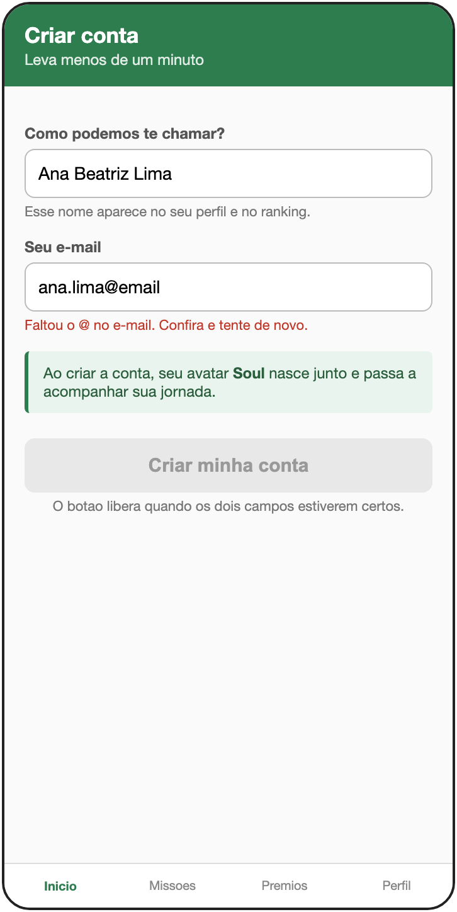
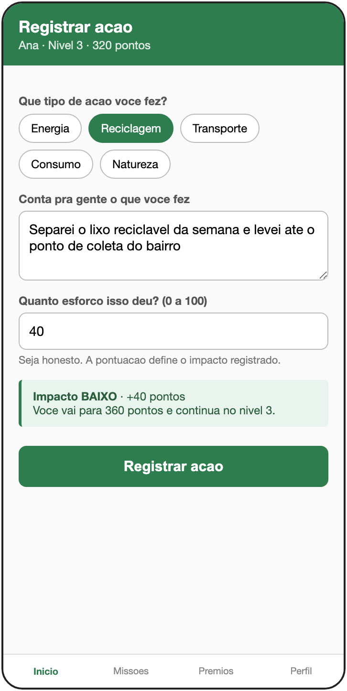
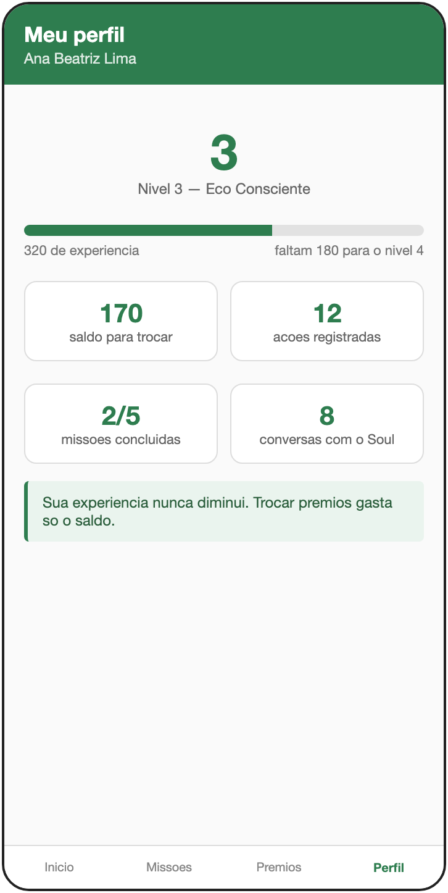
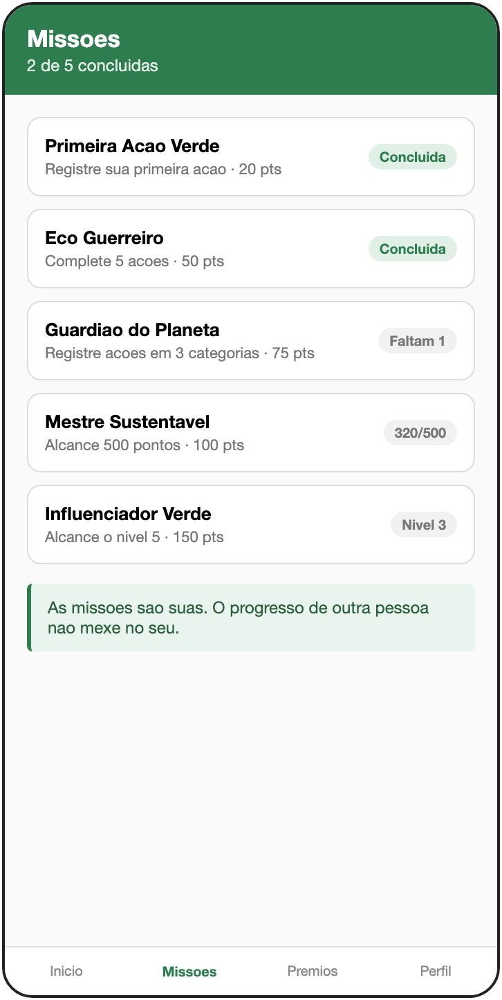
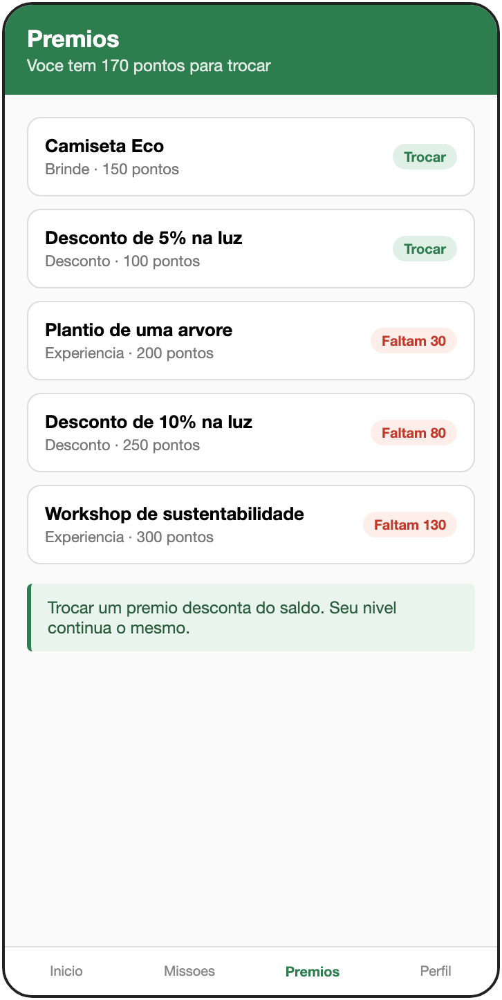

# SoulUp — Avatar Inteligente e Interativo

Aplicação web do **SoulUp**, uma plataforma que transforma ações sustentáveis do
dia a dia em pontos, níveis e recompensas reais, acompanhada por um avatar
chamado Soul.

O usuário registra o que fez — separou o lixo, foi de transporte público,
economizou energia — e cada ação vira experiência e saldo. A experiência faz ele
subir de nível; o saldo é trocado por desconto na conta de luz, brindes e
experiências.

Projeto do Challenge FIAP 2026, em parceria com SoulUp e Prospera.
Esta é a entrega da **Sprint 3**, em que o site das sprints anteriores foi
migrado de HTML e CSS para uma aplicação React de página única.

---

## Tecnologias utilizadas

| Tecnologia | Para quê |
|---|---|
| **React 18** | interface em componentes |
| **Vite 5** | servidor de desenvolvimento e build |
| **TypeScript 5** | tipagem em modo `strict` |
| **Tailwind CSS 3** | toda a estilização, sem CSS externo |
| **React Router DOM 6** | navegação SPA, com rotas estáticas e dinâmica |
| **React Hook Form 7** | validação do formulário de contato |
| **Git e GitHub** | versionamento com branches e pull requests |

---

## Estrutura de pastas

```
Challenge-1TDSPO/
├── index.html                 entrada do Vite
├── package.json               dependências e scripts
├── vite.config.ts             configuração do build
├── tsconfig.json              TypeScript em modo strict
├── tailwind.config.js         paleta e tema do projeto
├── public/                    favicon, copiado direto para o build
├── assets/                    fotos dos integrantes
└── src/
    ├── main.tsx               ponto de partida da aplicação
    ├── App.tsx                todas as rotas
    ├── index.css              diretivas do Tailwind
    ├── types.ts               tipos do domínio
    ├── components/            reutilizáveis em várias páginas
    │   ├── Layout.tsx         estrutura comum a todas as telas
    │   ├── Header.tsx         cabeçalho com menu responsivo
    │   ├── Footer.tsx         rodapé
    │   ├── Botao.tsx          botão em duas variações
    │   └── Card.tsx           cartão de conteúdo
    ├── pages/                 uma por rota
    │   ├── Home.tsx
    │   ├── Sobre.tsx
    │   ├── Solucao.tsx
    │   ├── Integrantes.tsx
    │   ├── IntegranteDetalhe.tsx
    │   ├── Faq.tsx
    │   └── Contato.tsx
    └── data/                  conteúdo separado da apresentação
        ├── integrantes.ts
        ├── missoes.ts
        └── faq.ts
```

### Rotas

| Caminho | Página |
|---|---|
| `/` | Home |
| `/sobre` | Sobre o projeto |
| `/solucao` | Solução, com missões e evolução do avatar |
| `/integrantes` | Equipe |
| `/integrantes/:rm` | Perfil de um integrante — **rota dinâmica** |
| `/faq` | Perguntas frequentes |
| `/contato` | Formulário de contato |

---

## Como usar

### Rodando na sua máquina

Precisa do **Node 18 ou mais novo**.

```bash
git clone https://github.com/matheusruiz-07/Challenge-1TDSPO
cd Challenge-1TDSPO
npm install
npm run dev
```

Depois é só abrir <http://localhost:5173>.

Para gerar a versão de produção:

```bash
npm run build
npm run preview
```

### Links

- **Repositório:** <https://github.com/matheusruiz-07/Challenge-1TDSPO>
- **Vídeo de apresentação:** <https://youtu.be/mIHZOm-AsJk>

---

## Telas do sistema

| Cadastro | Registrar ação | Perfil |
|---|---|---|
|  |  |  |

| Missões | Recompensas |
|---|---|
|  |  |

---

## Autores

<table>
  <tr>
    <td align="center" width="50%">
      <br>
      <b>Matheus Ruiz Giatti</b><br>
      RM 570701 &middot; Turma 1TDSPO<br><br>
      Banco de dados e back-end Java<br><br>
      <a href="https://github.com/matheusruiz-07">GitHub</a> &middot;
      <a href="https://www.linkedin.com/in/matheus-ruiz-9215ba325/">LinkedIn</a>
    </td>
    <td align="center" width="50%">
      <br>
      <b>Matheus Leite Souza das Virgens</b><br>
      RM 573416 &middot; Turma 1TDSPO<br><br>
      Front-end e lógica em Python<br><br>
      <a href="https://github.com/matheusleite21">GitHub</a> &middot;
      <a href="https://www.linkedin.com/in/matheus-leite-aaab75352/">LinkedIn</a>
    </td>
  </tr>
</table>

---

## Contato

Dúvidas sobre o projeto podem ser enviadas pelo LinkedIn de qualquer um dos dois
integrantes, ou pela página de contato da própria aplicação, em `/contato`.

Para questões sobre o código, abra uma
[issue no repositório](https://github.com/matheusruiz-07/Challenge-1TDSPO/issues).

---

## Como o projeto está organizado no Git

O repositório segue um fluxo com branches:

- **`main`** — o que está pronto para entrega
- **`develop`** — integração do trabalho em andamento
- **`feature/...`** — uma branch por tarefa, com pull request para a `develop`

Challenge FIAP 2026 &middot; Turma 1TDSPO &middot; Sprint 3
